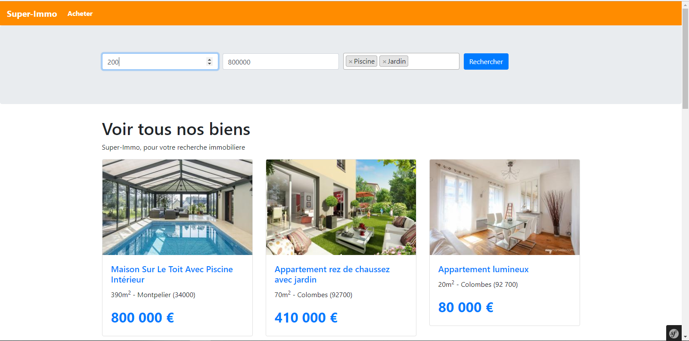
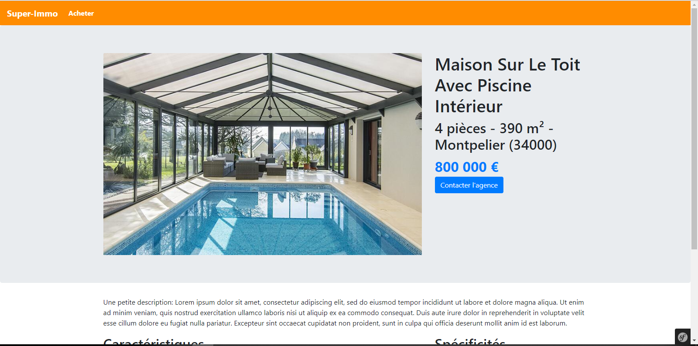
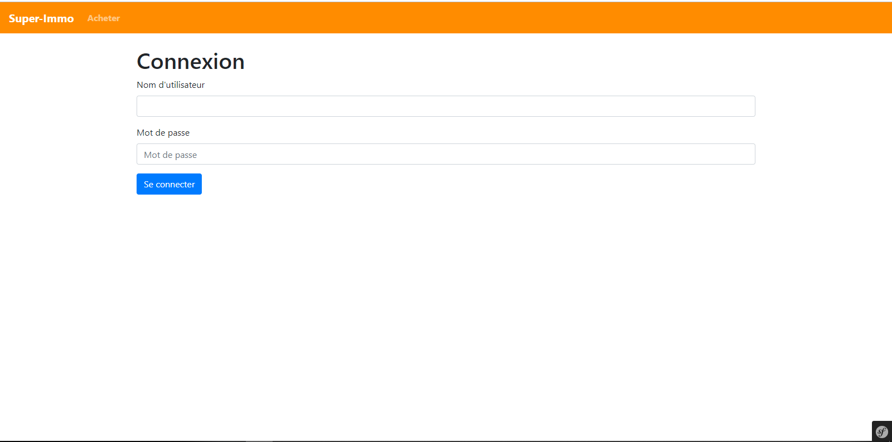
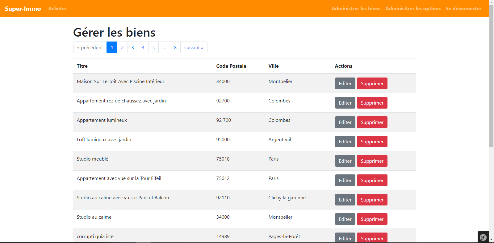
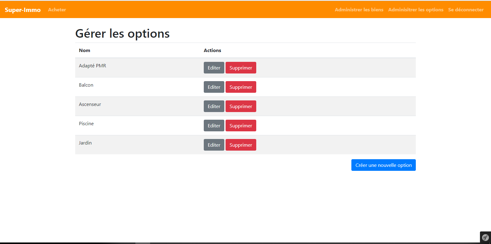

# super-immo
Projet symfony 4.2.

# Description
Application de gestion des appartements pour une agence immobilière avec un environnement backend sécurisé pour administrer les biens.

# Acceuil

# Un bien

# Administrateur Connexion

# Administrateur gestion des biens

# Administrateur edition d'un bien

# Administrateur gestion des options
